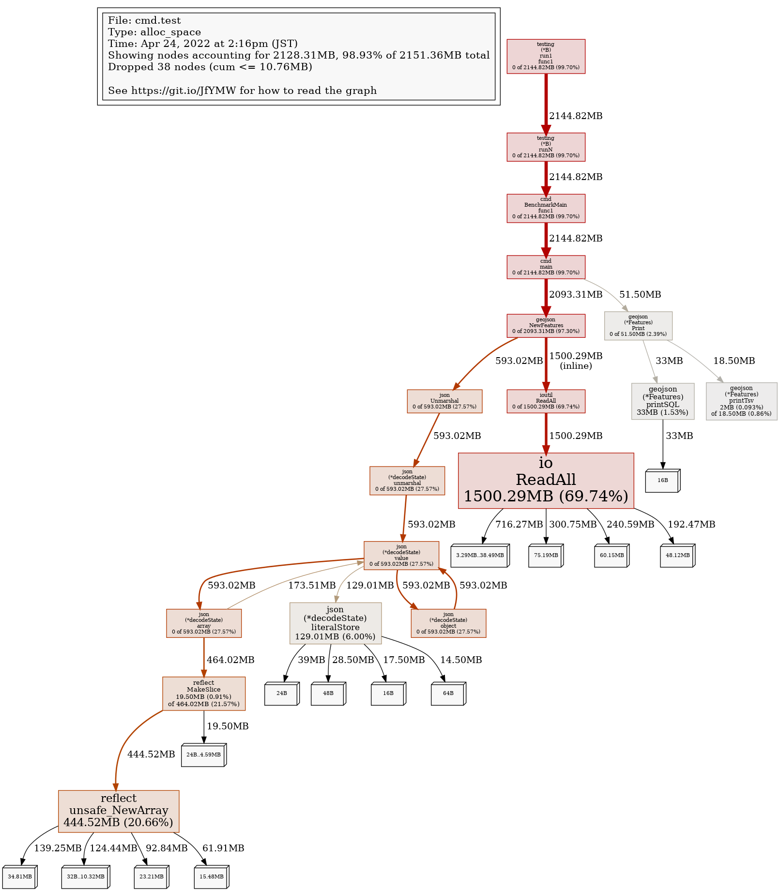
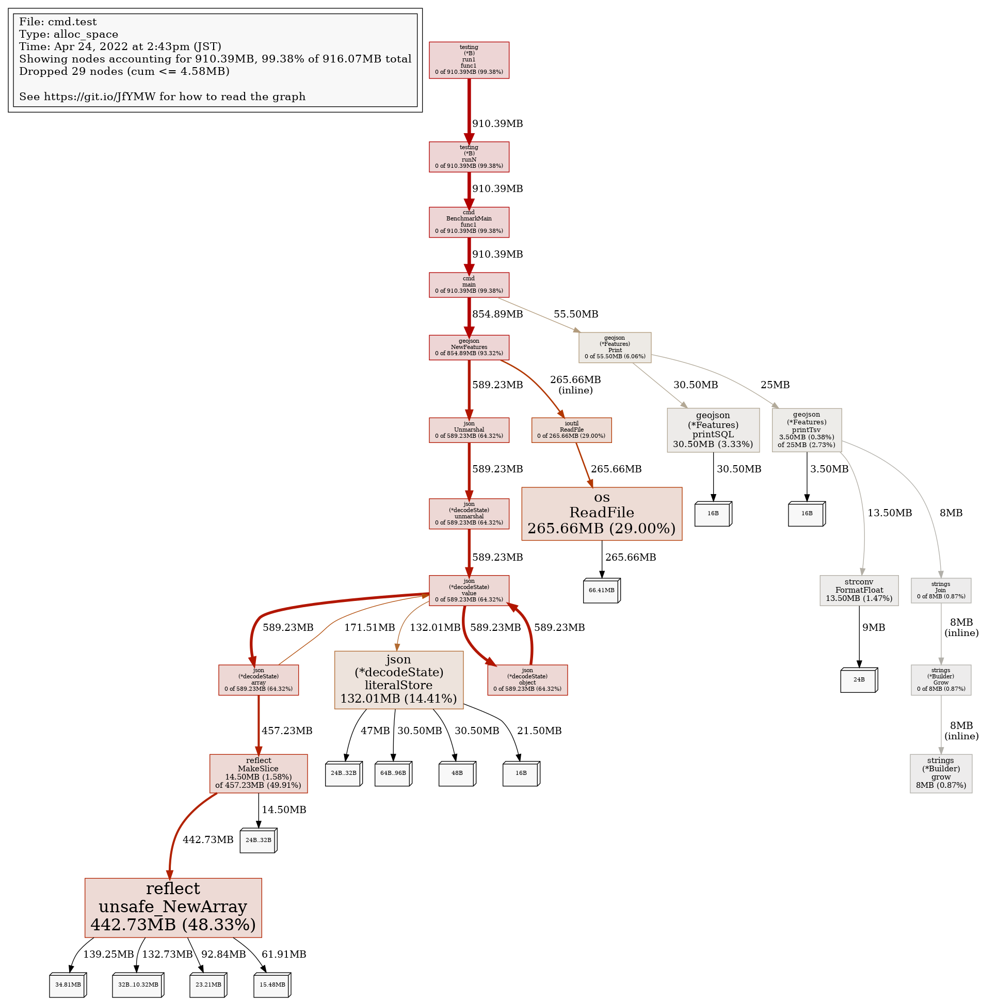

https://hub.docker.com/_/mysql


## Benchemark

JSON読んで、SQLを生成するまで、とSQLをMySQLに流してinsertするまでを比べると、圧倒的に後半が時間がかかるので、まずは後半を試してみる。

### MySQLへの投入

ここで試したのは４パターン

- 0 単一トランザクションで、insert文を実行. insert into hospital () values() の繰り返し。
- 1 table lock してauto commit。
- 2 auto commit。
- 3 insertの複数value.  insert into hospital () values (),(),().. と、value 指定の繰り返し。

```sh
$ make benchmark
docker compose -f docker-compose.yml exec dev /bin/bash -c "cd dataImport && make benchmark"
rm ../data/P04-20-0.sql ../data/P04-20-1.sql ../data/P04-20-2.sql ../data/P04-20-3.sql
rm ../data/P04-20-0.txt ../data/P04-20-1.txt ../data/P04-20-2.txt ../data/P04-20-3.txt
./bin/geojson2sql -s 0 -j ../data/P04-20.geojson > ../data/P04-20-0.sql
echo "truncate table hospital;" | mysql -h ${MYSQL_HOST} -u ${MYSQL_USER} --password=${MYSQL_PASSWORD} --database=geo
time cat ../data/P04-20-0.sql | mysql -h ${MYSQL_HOST} -u ${MYSQL_USER} --password=${MYSQL_PASSWORD} --database=geo | tee ../data/P04-20-0.txt

real    1m47.371s
user    0m2.902s
sys     0m13.037s
./bin/geojson2sql -s 1 -j ../data/P04-20.geojson > ../data/P04-20-1.sql
echo "truncate table hospital;" | mysql -h ${MYSQL_HOST} -u ${MYSQL_USER} --password=${MYSQL_PASSWORD} --database=geo
time cat ../data/P04-20-1.sql | mysql -h ${MYSQL_HOST} -u ${MYSQL_USER} --password=${MYSQL_PASSWORD} --database=geo | tee ../data/P04-20-1.txt

real    45m29.341s
user    0m7.345s
sys     0m16.694s
./bin/geojson2sql -s 2 -j ../data/P04-20.geojson > ../data/P04-20-2.sql
echo "truncate table hospital;" | mysql -h ${MYSQL_HOST} -u ${MYSQL_USER} --password=${MYSQL_PASSWORD} --database=geo
time cat ../data/P04-20-2.sql | mysql -h ${MYSQL_HOST} -u ${MYSQL_USER} --password=${MYSQL_PASSWORD} --database=geo | tee ../data/P04-20-2.txt

real    43m47.778s
user    0m7.280s
sys     0m16.113s
./bin/geojson2sql -s 3 -j ../data/P04-20.geojson > ../data/P04-20-3.sql
echo "truncate table hospital;" | mysql -h ${MYSQL_HOST} -u ${MYSQL_USER} --password=${MYSQL_PASSWORD} --database=geo
time cat ../data/P04-20-3.sql | mysql -h ${MYSQL_HOST} -u ${MYSQL_USER} --password=${MYSQL_PASSWORD} --database=geo | tee ../data/P04-20-3.txt

real    1m19.526s
user    0m0.167s
sys     0m0.167s
```

### SQLの生成

まずは、最初のコードをBenchmarkして、memprofile を見る。コード的には単純なので、まずはメモリから。

```sh
$ go test -benchmem -run='^$' -bench '^BenchmarkMain$' -memprofile tmp/memprofile.out -cpuprofile tmp/profile.out github.com/takekazuomi/docker-mysql01/import/cmd -v
goos: linux
goarch: amd64
pkg: github.com/takekazuomi/docker-mysql01/import/cmd
cpu: Intel(R) Core(TM) i7-7700 CPU @ 3.60GHz
BenchmarkMain
BenchmarkMain/P04-20.geojson
BenchmarkMain/P04-20.geojson-8                 1        1182726700 ns/op        557567760 B/op   2551299 allocs/op
BenchmarkMain/P04-20.geojson#01
BenchmarkMain/P04-20.geojson#01-8              1        1207487000 ns/op        557551016 B/op   2550972 allocs/op
BenchmarkMain/P04-20.geojson#02
BenchmarkMain/P04-20.geojson#02-8              1        1186791800 ns/op        557546168 B/op   2550968 allocs/op
BenchmarkMain/P04-20.geojson#03
BenchmarkMain/P04-20.geojson#03-8              1        1165761500 ns/op        573048088 B/op   2732283 allocs/op
```

```
$ go tool pprof tmp/memprofile.out

(pprof) top
Showing nodes accounting for 2128.31MB, 98.93% of 2151.36MB total
Dropped 38 nodes (cum <= 10.76MB)
Showing top 10 nodes out of 18
      flat  flat%   sum%        cum   cum%
 1500.29MB 69.74% 69.74%  1500.29MB 69.74%  io.ReadAll
  444.52MB 20.66% 90.40%   444.52MB 20.66%  reflect.unsafe_NewArray
  129.01MB  6.00% 96.40%   129.01MB  6.00%  encoding/json.(*decodeState).literalStore
      33MB  1.53% 97.93%       33MB  1.53%  github.com/takekazuomi/docker-mysql01/import/geojson.(*Features).printSQL
   19.50MB  0.91% 98.84%   464.02MB 21.57%  reflect.MakeSlice
       2MB 0.093% 98.93%    18.50MB  0.86%  github.com/takekazuomi/docker-mysql01/import/geojson.(*Features).printTsv
         0     0% 98.93%   593.02MB 27.57%  encoding/json.(*decodeState).array
         0     0% 98.93%   593.02MB 27.57%  encoding/json.(*decodeState).object
         0     0% 98.93%   593.02MB 27.57%  encoding/json.(*decodeState).unmarshal
         0     0% 98.93%   593.02MB 27.57%  encoding/json.(*decodeState).value
```


ファイルサイズが、67MのJSONを４回読んでるが、それでio.ReadAllが1.5Gも使っている。reflect.unsafe_NewArray もガッツリメモリ使っているので、おそらく読んでる途中で。バッファーのリアロケーションを繰り返しているのだと予想される。死にそうだ。

### ReadFile版

ぐぐったら、`ioutil.ReadFile` が**まだまし**と書いてあったので、`ReadFile`にしてみた。どうやら、`ioutil.ReadAll`は、Readerから読む（＝サイズがわからない）。ReadFileはファイルから読む（= ファイルなら読む前にサイズがわかる）ということらしい。当たり前である。

```
$ go test -benchmem -run='^$' -bench '^BenchmarkMain$' -memprofile tmp/memprofile.out -cpuprofile tmp/profile.out github.com/takekazuomi/docker-mysql01/import/cmd -v
goos: linux
goarch: amd64
pkg: github.com/takekazuomi/docker-mysql01/import/cmd
cpu: Intel(R) Core(TM) i7-7700 CPU @ 3.60GHz
BenchmarkMain
BenchmarkMain/P04-20.geojson
BenchmarkMain/P04-20.geojson-8                 1        1182859700 ns/op        233744312 B/op   2551262 allocs/op
BenchmarkMain/P04-20.geojson#01
BenchmarkMain/P04-20.geojson#01-8              1        1141279700 ns/op        233720560 B/op   2550917 allocs/op
BenchmarkMain/P04-20.geojson#02
BenchmarkMain/P04-20.geojson#02-8              1        1119044800 ns/op        233717488 B/op   2550916 allocs/op
BenchmarkMain/P04-20.geojson#03
BenchmarkMain/P04-20.geojson#03-8              1        1115623000 ns/op        249203696 B/op   2732234 allocs/op
PASS
ok      github.com/takekazuomi/docker-mysql01/import/cmd        4.732s

$ go tool pprof tmp/memprofile.out
File: cmd.test
Type: alloc_space
Time: Apr 24, 2022 at 2:43pm (JST)
Entering interactive mode (type "help" for commands, "o" for options)
(pprof) top
Showing nodes accounting for 910.39MB, 99.38% of 916.07MB total
Dropped 29 nodes (cum <= 4.58MB)
Showing top 10 nodes out of 22
      flat  flat%   sum%        cum   cum%
  442.73MB 48.33% 48.33%   442.73MB 48.33%  reflect.unsafe_NewArray
  265.66MB 29.00% 77.33%   265.66MB 29.00%  os.ReadFile
  132.01MB 14.41% 91.74%   132.01MB 14.41%  encoding/json.(*decodeState).literalStore
   30.50MB  3.33% 95.07%    30.50MB  3.33%  github.com/takekazuomi/docker-mysql01/import/geojson.(*Features).printSQL
   14.50MB  1.58% 96.65%   457.23MB 49.91%  reflect.MakeSlice
   13.50MB  1.47% 98.13%    13.50MB  1.47%  strconv.FormatFloat
       8MB  0.87% 99.00%        8MB  0.87%  strings.(*Builder).grow (inline)
    3.50MB  0.38% 99.38%       25MB  2.73%  github.com/takekazuomi/docker-mysql01/import/geojson.(*Features).printTsv
         0     0% 99.38%   589.23MB 64.32%  encoding/json.(*decodeState).array
         0     0% 99.38%   589.23MB 64.32%  encoding/json.(*decodeState).object
(pprof) png
Generating report in profile001.png
```


かかる時間は変わらないけど、メモリが半分になった。

## MySQLでload data

追加で、５つ目の方法を試す。これが一番速いはず。基本的なアイデアは、geojsonから、tsvファイルを作成する。そして、`temporary table` に、`load data local`で`insert`後、目的のテーブルに、`insert into`でコピーする。概ね１分７秒程度で終わる。
そのために、下記のようなSQLを用意して、`${DATA_FILENAME}` の部分をgeojsonから生成する。もしかしたら、MySQL 8なら直接geojsonが読めるかもしれないが、調べていない。

```sql
drop temporary table if exists temp_hospital;

create temporary table temp_hospital (
  id bigint auto_increment primary key,
  name varchar(500),
  latpoint float,
  lngpoint float
);

load data local infile '${DATA_FILENAME}'
into table temp_hospital (@1, @2, @3)
set
  name = @1,
  latpoint = @2,
  lngpoint = @3;

insert into
  hospital (name, location)
select
  name,
  st_srid(point(lngpoint, latpoint), 4326)
from
  temp_hospital
where
  lngpoint is not null
  and latpoint is not null
  and name is not null;
```

※サーバーのストレージにコピーすることができれば、`load data`(local無し)が使えてそれが一番速いはず。だが残念ながら、Azure MySQLではその手は使えないので、確認は後にする。

## TODO

- [ ] query
- [ ] go/sql版